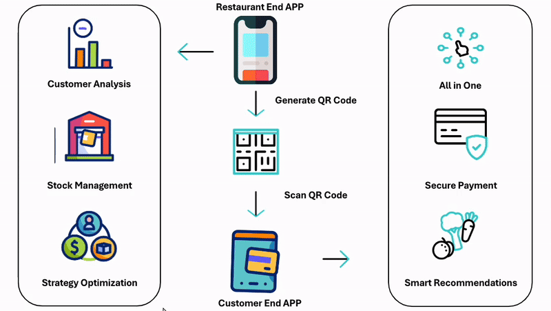

# QR-Code-based Restaurant Management System

A smooth and beautiful restaurant management system and its corresponding user-end application. It allows seamless interaction between restaurants and customers through QR code generation and scanning.

## Abstraction


_Overall abstraction_

## Funtionalities

### Interfaces

-   **Scan to Order**

    -   Guides customers to scan a code to order. After scanning, they enter the restaurant's menu page. If the scan fails, customers can manually enter the table number and be redirected to the menu page.

-   **Call the Waiter**

    -   Before scanning, redirects the user to the scan page.
    -   After scanning, a button can be pressed to display on the merchant's end that this table is calling for a server.

-   **Search**

    -   At the top of the page, there is a search bar where users can search for restaurant names, dishes, flavors, or allergies. Carousel guide words (e.g., "try gluten-free", "try spicy...") can be added.

-   **Location**

    -   In the future, a map can be integrated to view nearby restaurants based on current location.

-   **Coupon**  
    The top images on the page allow merchants to display different coupons and vouchers.

### Menu

-   **Categories**

    -   **Dish details**
        -   Categories are displayed in the left sidebar, categorized based on the merchant's needs.
        -   Dishes are displayed in list format, with images, name, and allergy information.
        -   Clicking on a dish shows detailed ingredients and flavor indicators (salty, sweet, sour, spicy).

-   **Add dish**

    -   In the dish list, quantity can be increased or decreased, allowing the user to add the dish to the shopping cart.

-   **Search**

    -   Users can search for dishes by style, flavor, or allergies.

-   **Filter**
    -   Users can directly filter dishes by meat, vegetables, flavor, or allergy information.

### Order

-   **Orders**

    -   Displays the cart.

-   **Add**

    -   Navigates to the menu.

-   **Pay**
    -   Navigates to the bills section.

### Bills

-   **Payment**

    -   A "Pay" button allows the customer to choose a tip amount of "0%", "5%", or "10%" and then redirects to Paytrail for payment. The payment information is sent to the front desk.

-   **Take-away**

    -   A button allows the user to notify the front desk that they need to pack their food.

-   **Call the Waiter**
    -   A button allows the user to signal the front desk for service.

### Personal

-   **Account**

    -   Users can register, log in, or recover a forgotten password. If users don't register, they will be unable to save their consumption history or personal taste preferences.

-   **Favor**

    -   Users can save favorite restaurants or dishes.

-   **Tastes**

    -   Users can set preferences for salty, sweet, sour, and spicy flavors. They can also add food allergies.

-   **Coupon**

    -   Users can view the coupons they have obtained.

-   **Contact Us**

    -   Users can contact the customer service.

-   **History**
    -   Users can view their purchase history.

### Scan to Order

-   After scanning a code, the user enters the restaurant's menu page. If the scan fails, they can manually enter the table number to be redirected to the menu page.

### Setting

-   Users can manage language, permissions, coupon notifications, etc.

_Italic text represents functionality that will not be displayed in the app but will be implemented._

-   Based on restaurant needs, payment can be initiated at the time of order confirmation.

## How to Run the Flutter Project on iOS

### Prerequisites

Make sure you have the following installed on your machine:

-   **Flutter SDK**: [Flutter Installation Guide](https://docs.flutter.dev/get-started/install)
-   **Xcode**: You need Xcode to run the project on iOS simulators or physical devices.
-   **CocoaPods**: This is required for managing iOS dependencies. If you haven't installed CocoaPods yet, run:

```bash
sudo gem install cocoapods
```

### Project File Structure

The main source code of this project is located in the `lib/` directory. Below are some important files:

```bash
lib/
├── main.dart                       # Main entry point of the application
├── components/                     # Reusable UI components
├── models/                         # Data models like food, order, restaurant
├── pages/                          # UI Pages such as login, home, register, etc.
├── services/                       # Backend service files like authentication and database services
├── utils/                          # Utility classes like popup notifications
└── images/                         # Images used in the project (e.g., apple logo, QR code)
```

### Steps to Run the iOS Version

#### 1. Navigate to the Project Directory

First, open your terminal and navigate to the root directory of your Flutter project:

```bash
cd /path/to/your/flutter_project
```

#### 2. Install Dependencies

Install the necessary Dart dependencies by running:

```bash
flutter pub get
```

#### 3. Install CocoaPods (For iOS)

Navigate to the `ios` directory and install the CocoaPods dependencies for the project:

```bash
cd ios
pod install
```

After `pod install` completes, return to the root directory:

```bash
cd ..
```

#### 4. Open the iOS Simulator or Connect Your Device

-   **iOS Simulator**: You can open the iOS Simulator directly from the command line by running:

```bash
open -a Simulator
```

-   **Real iOS Device**: If you want to run the app on a real device, ensure that it is connected to your machine and trusted.

#### 5. Build and Run the Project

To run the project on the iOS simulator or real device, execute the following command:

```bash
flutter run
```

Flutter will automatically detect available iOS simulators or connected physical devices.

#### 6. Running in Xcode (Optional)

If you want to open the project in Xcode for additional configurations or to troubleshoot, you can do so:

```bash
open ios/Runner.xcworkspace
```

Then, in Xcode:

-   Select your target device (Simulator or real device).
-   Click on the **Run** button (or use `Cmd + R`).

#### 7. Troubleshooting

If you encounter any issues, you can try the following:

-   **Clean the build**: Sometimes, cleaning the build can solve build issues:

```bash
flutter clean
```

-   **Check device logs**: Use `flutter doctor` to ensure everything is set up correctly:

```bash
flutter doctor
```

This will show you the current status of your Flutter installation and help resolve any missing dependencies or permissions.

### Additional Notes

-   The project's main entry point is `lib/main.dart`.
-   Make sure to adjust any platform-specific configurations in the `ios/` directory as needed.
-   For Firebase-related services, ensure `firebase_options.dart` and any other configurations are set up properly for iOS.
